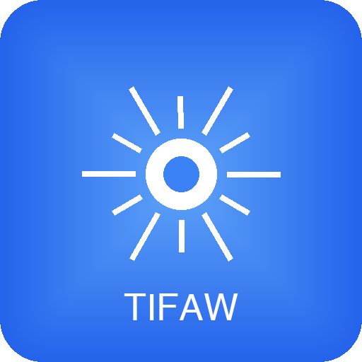

<p align="center">
  
</p>

<h1 align="center">Tifaw</h1>

<p align="center"><strong>Your laptop's story, powered by local AI.</strong></p>

Tifaw (ⵜⵉⴼⴰⵡ) - meaning "clarity" or "radiance" in Tamazight (Amazigh/Berber) - is a local AI desktop assistant that helps you understand everything on your machine. It automatically analyzes, categorizes, and organizes your files using Google's Gemma 4 model running entirely on your laptop through Ollama. No cloud, no telemetry, no subscriptions.

Tifaw doesn't just list files -- it tells the story of your digital life. It knows your photos, recognizes faces, groups documents by purpose, tracks your code projects, and lets you ask questions about everything in plain English.

---

## Features

### Your Laptop's Story
- **Overview dashboard** -- animated stats, timeline of activity, storage breakdown, and story cards that summarize your digital life
- **Category donut chart** -- visual breakdown of file types with percentages
- **Photo map** -- interactive Leaflet map showing where your photos were taken using GPS metadata
- **Calendar heatmap** -- GitHub-style daily activity grid for the past year
- **Top stats cards** -- busiest month, most seen person, oldest file, largest file, top camera
- **People co-occurrence** -- discover who appears together most in your photos
- **Context over location** -- files grouped by meaning (Finance, Education, Work) not by folder

### Photos & People
- **Face detection** -- automatic face detection using macOS Vision framework during indexing
- **Face recognition** -- 128-dimensional Apple Vision embeddings match the same person across photos
- **People management** -- auto-assigned placeholder names, rename once to apply everywhere, merge duplicates with visual person picker
- **Photo gallery** -- masonry grid with people filter bar, category filter, infinite scroll
- **File previews** -- inline previews for images, videos, PDFs (embedded viewer), and text/code files (30+ extensions) in the file detail modal

### File Metadata Extraction
- **EXIF from photos** -- date taken, GPS coordinates, camera make/model, ISO, aperture, focal length, exposure time, image dimensions
- **PDF metadata** -- title, author, subject, keywords, creation/modification dates, page count
- **Office metadata** -- author, title, dates, revision count from DOCX and XLSX files
- **Smart dates** -- EXIF date_taken is preferred over filesystem timestamps for accurate chronology

### Smart File Management
- **AI file understanding** -- multimodal analysis of images, PDFs, code, documents, and spreadsheets via Gemma 4 E4B
- **Smart renaming** -- detects generic filenames (IMG_2847.png, Screenshot 2026-...) and suggests descriptive names with thumbnail previews
- **Natural language search** -- full-text search powered by SQLite FTS5 with card-based results
- **Ask Tifaw** -- AI chat with context-aware search, delete via chat with confirmation, retry on failure
- **Bulk file actions** -- select multiple files in Photos/Documents/Search, then bulk delete, rename, or add context tags
- **File actions** -- open in Finder, re-index, rename, move to Trash directly from the UI

### Organization
- **Multi-folder watching** -- monitors Downloads, Desktop, Documents (configurable from UI)
- **Documents by purpose** -- Finance, Legal, Education, Work, Personal groupings
- **Smart group discovery** -- LLM analyzes tag patterns across 10+ files and creates new groups automatically (e.g. "Travel Bookings", "ID Documents", "Contracts") — persisted in database
- **Dev project scanner** -- detect code projects, frameworks, dependencies, and health via AI analysis
- **Spotlight fallback** -- uses macOS Spotlight index when Full Disk Access isn't available
- **Self-healing queue** -- pending files automatically re-queued after crashes or restarts

### Native macOS App
- **Custom app icon** -- Tifaw radiance symbol in dock, sidebar, favicon, and About panel
- **Native window** -- runs as a proper macOS app via pywebview, not just a browser tab
- **Privacy mode** -- toggle blurs all photos, names, paths, and descriptions for safe screen recording and demos

### AI-Powered Insights
- **AI narrative** -- personalized story about your digital life, generated by Gemma
- **Weekly digest** -- AI summary of recent file activity shown on the overview
- **Photo stories** -- auto-generated story cards from photo clusters by month and location
- **People summaries** -- AI profile for each person based on their photo history
- **Smart duplicate advice** -- AI recommends which duplicate to keep with reasoning
- **Stale file cleanup** -- AI scores old files on how safe they are to delete
- **GPS to location names** -- resolves coordinates to city/country during indexing

### First-Run Onboarding
- **Welcome wizard** -- 3-step guided setup on first launch: intro, AI engine check, folder & identity config
- **Ollama health gate** -- auto-detects Ollama status with retry, shows install instructions if missing
- **Ollama offline banner** -- persistent warning bar when AI is unavailable, with quick-fix command
- **Empty states** -- friendly guidance on Overview and Documents when no files are indexed yet

### Settings
- **User identity** -- select which person you are so AI addresses you by name
- **Live configuration** -- change watch folders, project directories from the UI with folder picker
- **Re-index all files** -- bulk re-analyze every file to pick up new metadata after updates
- **Hot reload** -- settings apply immediately without server restart

## Tech Stack

| Layer | Technology |
|---|---|
| AI model | [Gemma 4 E4B](https://ai.google.dev/gemma) via [Ollama](https://ollama.com) |
| Face detection | macOS Vision framework via [PyObjC](https://pyobjc.readthedocs.io) |
| Backend | Python 3.11+, [FastAPI](https://fastapi.tiangolo.com), [Uvicorn](https://www.uvicorn.org) |
| Database | SQLite with FTS5 (via [aiosqlite](https://github.com/omnilib/aiosqlite)) |
| File watching | [Watchdog](https://github.com/gorakhargosh/watchdog) |
| PDF extraction | [PyMuPDF](https://pymupdf.readthedocs.io) |
| Image processing | [Pillow](https://pillow.readthedocs.io) |
| Native app | [pywebview](https://pywebview.flowrl.com) with AppKit branding |
| Frontend | [Tailwind CSS](https://tailwindcss.com) (CDN), [Alpine.js](https://alpinejs.dev), [marked.js](https://marked.js.org), [Leaflet](https://leafletjs.com) |

## Quick Start

### Prerequisites

- macOS (face detection uses Apple Vision framework)
- Python 3.11 or later
- [Ollama](https://ollama.com) installed and running
- ~5 GB disk space for the Gemma 4 E4B model

### Setup

```bash
git clone https://github.com/brahim-guaali/Tifaw.git
cd Tifaw
python3 -m venv .venv
make setup    # checks prereqs, installs deps, pulls gemma4:e4b, runs doctor
```

### Run

```bash
make dev      # starts the server at http://127.0.0.1:8321
```

Open [http://127.0.0.1:8321](http://127.0.0.1:8321) in your browser, or run as a native macOS app:

```bash
python -m tifaw.app   # opens a native window via pywebview
```

### Configuration

Settings can be changed directly from the UI (Settings page), or by editing `config.yaml`:

```yaml
watch_folders:
  - ~/Downloads
  - ~/Desktop
  - ~/Documents

project_directories:
  - ~/Projects

rename:
  enabled: true
  auto_approve: false

cleanup:
  threshold_days: 90
```

## Project Structure

```
Tifaw/
  tifaw/                 # Python package
    api/                 # FastAPI route handlers
      routes_overview.py # Story dashboard API
      routes_photos.py   # Photo gallery with filters
      routes_faces.py    # Face detection & people management
      routes_documents.py# Documents grouped by purpose
      routes_config.py   # Live settings API with folder browser
      routes_onboarding.py # First-run onboarding wizard API
      routes_files.py    # File CRUD, preview, reveal, delete
      routes_rename.py   # Smart rename proposals
      routes_search.py   # Full-text search
      routes_chat.py     # AI chat
      routes_projects.py # Code project scanner
    chat/                # AI chat agent with tool-calling (ReAct loop)
    faces/               # Face detection & recognition (Vision framework)
    indexer/             # Content extraction, metadata extraction, LLM analysis, queue
    llm/                 # Ollama client wrapper
    models/              # Database layer + Pydantic schemas
    renamer/             # Generic name detection + smart rename
    watcher/             # Watchdog file system observer + Spotlight fallback
    smartfolders/          # Dynamic document group discovery
    config.py            # Settings loader (YAML + env)
    main.py              # FastAPI app + lifespan
    app.py               # Native macOS app launcher (pywebview + branding)
  frontend/              # Static frontend
    index.html           # Alpine.js SPA with Tailwind CSS
    app.js               # Application logic
    styles.css           # Custom animations & components
    icon.png             # App icon (512x512)
  config.yaml            # User configuration
  Makefile               # Dev commands
  pyproject.toml         # Package metadata + dependencies
```

## Development

```bash
make lint      # run ruff checks
make format    # auto-fix formatting
make test      # run pytest
make clean     # remove caches and build artifacts
```

### Troubleshooting

If something isn't working after setup, run the health check:

```bash
make check     # re-run prerequisite checks only
make doctor    # full health check (venv, Ollama, model, data dir, config)
```

Common issues:
- **Ollama not running**: Start with `open -a Ollama` or `ollama serve`
- **Model not found**: Run `ollama pull gemma4:e4b`
- **Python version too old**: Tifaw requires Python 3.11+

## License

Apache License 2.0. See [LICENSE](LICENSE).
